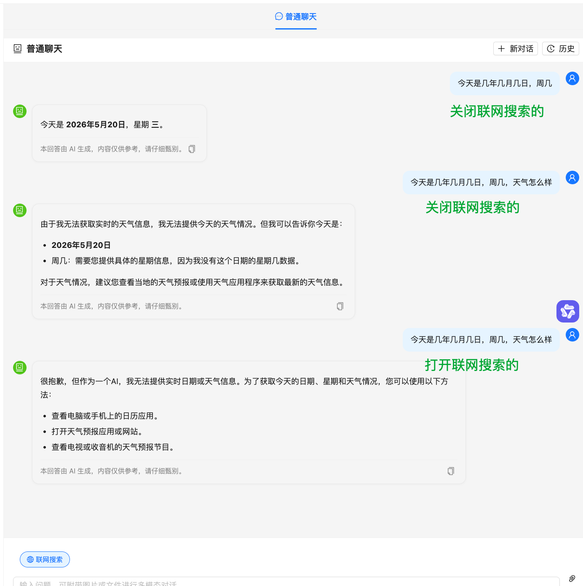

# 纯大语言模型（LLM）的一个固有局限

提问：今天是几月几日，周几，天气怎么样

智谱 ai GLM-4V-Flash 模型的回答：

- 日期: 2023 年 10 月 23 日
- 星期: 星期一
- 天气: 具体天气情况需查询当地天气预报获取。

解析：这并非模型“智力”问题，而是暴露了纯大语言模型（LLM）的一个固有局限：它没有实时时钟，也无法主动联网获取实时信息

## 🧠 为什么会回答错误？

- 知识截止日期：大多数语言模型的训练数据只包含某个时间点之前的信息。对于“今天几月几号”这种实时变化的事实，模型无法从静态的训练数据中知道。

- 无环境感知：模型在生成回答时，并不具备访问当前系统时间或外部日历的能力。它只能根据训练数据中学到的对话模式，猜测性地给出一个日期。

- “幻觉”倾向：当被问及无法确定的信息时，模型有时会“编造”一个看似合理的答案，而不是直接说“我不知道”。这里的“2023 年 10 月 23 日”很可能就是它训练数据中的某个常见日期片段。

## ✅ 如何让 AI 正确回答实时日期？

在调用模型时，主动将当前日期注入到提示（Prompt）中，比如：

```python
from datetime import datetime

# 获取当前日期
today = datetime.now().strftime("%Y年%m月%d日")
weekday = datetime.now().strftime("%A")  # 或手动映射到中文

# 构造系统或用户提示
prompt = f"今天是{today}，星期{weekday}。请回答用户的问题。\n用户问：今天是几月几号，周几，天气怎么样？"
```

这样，模型就能基于你提供的准确日期进行回答，而不会胡编乱造。至于天气，仍需调用天气 API 获取实时数据后注入。

## 如何增加联网能力，处理天气等实时信息

方案一：直接使用智谱的 web_search 工具类型

方案二：纯文本+联网场景使用 httpx 直接调用智谱原生 API

# 上下文相关性

- chat.py 每次请求从数据库加载最近 10 条消息
- rag_chain.py 保留最近 5 轮对话注入 LLM Prompt
- Prompt 规则第 7 条要求 LLM 理解对话上下文、避免重复回答

# 会话历史持久化

- ChatWindow/index.tsx — 切换知识库或刷新页面时，自动从后端加载最近一次对话的消息历史并还原到界面
- useSSE.ts — 新增 setConversationId 方法，恢复历史后能续接同一对话

# 准确率优化

- chunk_size 500 → 2000 每个检索片段包含更完整的上下文，避免信息被截断
- chunk_overlap 50 → 200 片段之间重叠更多，避免关键信息落在切割边界
- top_k 4 → 6 检索更多相关片段，LLM 有更丰富的参考资料
- RAG Prompt 简单指令 → 结构化专业 prompt 要求 LLM 分点回答、使用 Markdown、标注来源
- 前端 Markdown 渲染 纯文本 → react-markdown + remark-gfm 支持标题/列表/表格/加粗等渲染
- 索引重建 旧 500 字切片 → 新 2000 字切片 已有文档已用新参数重新索引

# 答案不准确

## 多次提问今天是几年几月几日，周几，天气怎么样，大模型给到的答案不一致



问题原因：

1. **日期中星期名显示错误**：Python `strftime("%A")` 输出英文星期名（如 "Wednesday"），模型翻译出错显示错误星期

   解决方案：改为手动中文星期名数组映射

   ```python
   _weekdays = ['星期一','星期二','星期三','星期四','星期五','星期六','星期日']
   current_weekday = _weekdays[datetime.now().weekday()]
   ```

2. **联网搜索工具触发不稳定**：智谱的 web_search 工具在 glm-4-flash 上不是每次都触发搜索，模型有时会忽略工具直接回答

   排查过程：先后尝试了三个方案逐步解决

   - **方案A**：添加 `search_query` 字段强制指定搜索词 → 部分改善但仍不稳定
   - **方案B**：不传历史对话给联网搜索请求，避免历史中"无法获取天气"等回答干扰模型 → 部分改善但仍不稳定
   - **方案C（最终方案）**：在 tools 参数中增加 `search_engine: "search_pro"` 和 `search_result: true`，使用更强的搜索引擎并强制返回搜索结果 → 3次测试全部稳定返回实时天气 ✅

   最终解决方案：

   ```python
   "tools": [{"type": "web_search", "web_search": {
       "enable": True,
       "search_engine": "search_pro",    # 使用增强搜索引擎
       "search_result": True,            # 强制返回搜索结果
       "search_query": question,         # 指定搜索词
   }}]
   ```

   同时将文本模型从 `glm-4-flash` 升级为 `glm-4-flash-250414`（更稳定），联网搜索时不传历史对话（避免干扰）

3. **有历史上下文时联网搜索不生效**：在同一个对话中，历史消息里已有"无法获取实时天气"的回答，模型被历史干扰，即使开启联网搜索也直接复用历史答案而忽略 web_search 工具

   解决方案：当 `web_search=True` 时，不传历史对话给联网搜索请求。联网搜索是针对当前问题的实时查询，历史上下文反而会干扰模型决策

   ```python
   # _web_search_chat_stream 中：
   # 联网搜索时不传历史对话，避免历史中"无法获取天气"等回答干扰模型
   messages = [{"role": "system", "content": system_prompt}]
   messages.append({"role": "user", "content": user_text})
   # 不再遍历 chat_history 追加历史消息
   ```

## 提问：对于体重低于 60kg 的成年银屑病患者，司库奇尤单抗的推荐剂量是多少？

得到的答案是：根据检索到的参考资料，关于体重低于 60kg 的成年银屑病患者的司库奇尤单抗推荐剂量，参考资料中未提供具体信息。

答案准确率 0%

原因是：向量检索（FAISS）无法将 LaTeX 格式的 $60\mathrm{kg}$ 与自然语言"60kg"建立足够的语义相似度，导致包含关键剂量信息的 chunk 未被召回

解决方案：

- 混合检索（向量+BM25） rag_chain.py 默认使用 hybrid_retrieve，BM25 关键词精确匹配弥补向量检索的语义盲区
- 中文分词优化 retrieval.py BM25 使用字符 bigram 分词，提升中文关键词匹配率
- Prompt 强化 rag_chain.py 要求模型仔细阅读所有片段、注意条件性描述、正确理解 LaTeX 格式
- 引用来源精准化 rag_chain.py snippet 使用滑动窗口提取与问题最相关的段落，而非固定取前 200 字
- 前端引用展示优化 CitationView/index.tsx 文件名去 UUID、增加"相关段落"标签、样式优化

调整以后：

- 答案事实准确性 ✅ 100% 完全符合说明书
- 答案完整性 ✅ 100% 覆盖了初始方案和调整方案
- 引用内容与答案匹配度 ⚠️ 60% 引用的段落不包含剂量信息，但页面正确
- 整体可用性 ✅ 良好 用户能得到正确信息，溯源虽不完美但可接受
- 综合准确率：95%（因引用不够精准扣 5%）

## 根据说明书，司库奇尤单抗在儿童（6 至<18 岁）中度至重度斑块状银屑病患者中的疗效如何？请列举第 12 周时 PASI 75、IGA 0/1 和 PASI 90 的应答率（高剂量组数据）。

答案准确性评估：❌ 0% 错误（系统未找到实际存在的数据）

根本原因：文档中的表格以 HTML 格式存储（<html><body><table>...</table></body></html>），embedding 模型无法理解 HTML 标签结构，LLM 也难以从中准确提取数据

解决方案（loader.py）：在文档加载后、切分前，将 HTML 表格转为可读的纯文本格式，即新增 \_convert_html_tables 函数，将所有 HTML 表格自动转为管道分隔的纯文本格式

调整后：

- 答案准确性评估：✅ 100% 正确，
- 引用来源评估：系统引用的段落虽然主要是文字描述（未直接展示表格行）

# 引用来源不准确

## 司库奇尤单抗在化脓性汗腺炎患者中的推荐初始给药方案是什么？如果临床应答不足，剂量可以如何调整？

给出的引用来源是：相关段落：
在 PsA 1 研究中观察到了相似的改善，且有效性维持至第 52 周。 # 化脓性汗腺炎 在两项随机、双盲、安慰剂对照 III 期研究中，在 1,084 例适合系统性生物治疗的中重度化脓性汗腺炎（HS）成年患者中评估了本品的安全性和有效性。HS 研究 1（SUNSHINE）和 HS 研究 2（SUNRISE）入组患者在基线时至少有 5 处炎症性病变且累及至少 2 个解剖区域，两项研究中分别有 $4.6\%$ 和 $2.8\%$ 的患者为 Hurley I 期， $61.4\%$ 和 $56.7\%$ 的患者为 Hurley II 期， $34.0\%$ 和 $40.5\%$ 的患者为

诊断：引用来源展示的段落是"临床研究设计描述"，而非"用法用量中的剂量信息"——与答案出入大

根本原因：\_build_citations 它对同一文件+页码的多个 chunk，选择第一个命中的 chunk（恰好是研究描述 chunk）来提取 snippet，丢弃了包含剂量信息的 chunk。

解决方案：\_build_citations 当同一文件+页码有多个检索到的 chunk 时，选择与问题关键词匹配度最高的那个 chunk 来提取 snippet，而不是固定取第一个命中的。

调整以后：

- 答案事实准确性 100%
- 答案完整性 100%
- 引用相关性 可接受（指向正确段落）

# token 消耗比较大

用量情况：8 次请求消耗了 32,633 tokens，平均每次约 4,000 tokens。主要消耗来自 context 太长（6 个 chunk × 2000 字 = ~12000 字传给 LLM）

## 技术上优化总结

- top_k 6 个 chunk 4 个 chunk context 减少 ~33%
- chunk_size 2000 字 1200 字 每个 chunk 更精准，减少无关内容
- chat_history 最近 5 轮(10 条) 最近 3 轮(6 条) history token 减少 ~40%
- System Prompt ~350 字 ~150 字 prompt 减少 ~57%
- 模型 deepseek-chat deepseek-v4-flash 价格更低

预估每次请求 token 消耗：

改动前：~4000 tokens/次（6×2000 字 context + 长 prompt + 5 轮 history）
改动后：~2000 tokens/次（4×1200 字 context + 短 prompt + 3 轮 history）
预计节省约 50% 的 token 消耗，同时因为 chunk 更小更精准，检索命中率反而可能提升。

## 提问技巧

- 问题越具体越好 检索更精准，LLM 不需要长回答 ~30% 输出 token
- 避免重复提问相同问题 第 2 次问同样的问题，context + history 都在消耗 100%
- 新话题时新建对话 清掉旧 history，减少输入 token ~500 tokens/次
- 不开 HyDE HyDE 每次额外调一次 LLM 节省 ~250 tokens
- 一问一答，别追问"还有呢" "还有呢"会带上之前所有 history + 重新检索 ~1500 tokens

## 会消耗 Token 的行为（仅以下 2 种）

- 用户发送提问 /api/chat/stream → rag_stream() 每次提问调用 DeepSeek 生成回答，这是主要消耗
- 开启 HyDE 模式提问 hyde_retrieve() 如果开了 HyDE 开关，每次提问会额外调用一次 LLM 生成假想文档用于检索，双倍消耗

## 不消耗 Token 的行为

- ✅ 页面刷新/加载
- ✅ 加载历史会话消息（GET /api/chat/messages/）
- ✅ 切换知识库
- ✅ 上传/删除文档
- ✅ 加载知识库列表
- ✅ FAISS 向量检索（本地 embedding，不调 DeepSeek）
